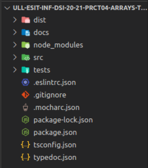

# Práctica 6: Clases e interfaces genéricas. Informe.
## Desarrollo de Sistemas Informáticos 
## Raúl Martín Rigor - alu0101203003@ull.edu.es

### Introducción

En este informe se resumen las actividades realizadas en la **práctica 6** para poner en práctica nuestros conocimientos de TypeScript. Será la primera práctica grupal y deberemos usar todas las herramientas aprendidas con anterioridad, seguir los principios SOLID y usar los patrones de diseño adecuados.

### Objetivos

Al finalizar la práctica, habremos completado los siguientes objetivos:

* Crear una estructura que nos permita el diseño y manipulación de menús
* Saber analizar que patron de diseño se debe utilizar según el caso
* Dominar el correcto uso conjunto de todas las distintas estructuras y tipos de datos

### 1. Creación y configuración del driectorio del proyecto.

#### 1.1. Estructura inicial

Para la creación de la estructura inicial, utilizaremos el mismo diseño que hemos implementado en practicas anteriores ([práctica 4 (*****)](https://github.com/ULL-ESIT-INF-DSI-2021/ull-esit-inf-dsi-20-21-prct04-arrays-tuples-enums-alu0101203003/blob/gh-pages/index.md)).

La estructura debería quedar similar a las siguientes fotos:

  

#### 1.2. Organización de los ejercicios

Será necesario implementar las clases del ejercicio en ficheros diferentes. Los ficheros que dependan de otros requeriran de un `import` del fichero que necesiten:

 

Se creará una subcarpeta para el ejercicio en la carpeta src y, su correspondiente espectativa se crearán en la carpeta test con un fichero para realizar las pruebas del ejercicio.

### 2. Ejercicio

Se pasa a explicar la resolución del ejercicio y a adjuntar su código y expectativa. Se mostrará una versión simplificada del enunciados del ejercicio (para verlo al completo con aclaraciones y pistas, consultar la [guía de la práctica](https://ull-esit-inf-dsi-2021.github.io/prct07-menu-dataModel/).

(Para poder acceder a los atributos privados que creemos en las clases usaremos funciones *set* y *get*, las cuales se pueden encontrar en el código fuente.)

#### 2.1 Alimentos y/o ingredientes

**Enunciado:**

Para cada alimento o ingrediente considerado dentro del sistema de diseño de menús se debe almacenar la información siguiente:

1. Grupo de alimentos al que pertenece que puede ser:
* Carnes, pescados, huevos, tofu, frutos secos, semillas y legumbres.
* Verduras y hortalizas.
* Leche y derivados.
* Cereales.
* Frutas.
2. La composición nutricional del alimento con respecto a los macronutrientes y kcal por 100 gr de dicho alimento.
* Macronutrientes: Hidratos de carbono, proteínas y lípidos.
3. Precio del alimento y/o ingrediente por kg en euros.

**Resolución:**

La estrategia a seguir para resolver este ejercicio pasa por usar la clas
