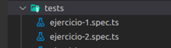

# Práctica 7: Modelo de datos de un sistema que permite el diseño de menús. Informe.
## Desarrollo de Sistemas Informáticos 
## Grupo Q

### Introducción

En este informe se resumen las actividades realizadas en la **práctica 7** para poner en práctica nuestros conocimientos de TypeScript. Será la primera práctica grupal y deberemos usar todas las herramientas aprendidas con anterioridad, seguir los principios SOLID y usar los patrones de diseño adecuados.

### Objetivos

Al finalizar la práctica, habremos completado los siguientes objetivos:

* Crear una estructura que nos permita el diseño y manipulación de menús
* Saber analizar que patron de diseño se debe utilizar según el caso
* Dominar el correcto uso conjunto de todas las distintas estructuras y tipos de datos
* Aprender a usar el módulo Inquirer.js para la gestión de una línea de comandos interactiva

### 1. Creación y configuración del driectorio del proyecto.

#### 1.1. Estructura inicial

Para la creación de la estructura inicial, utilizaremos el mismo diseño que hemos implementado en practicas anteriores (por ejemplo, [práctica 4](https://github.com/ULL-ESIT-INF-DSI-2021/ull-esit-inf-dsi-20-21-prct04-arrays-tuples-enums-alu0101203003/blob/gh-pages/index.md)).

La estructura debería quedar similar a las siguientes fotos:

  

#### 1.2. Organización de los ejercicios

Será necesario implementar las clases del ejercicio en ficheros diferentes. Los ficheros que dependan de otros requeriran de un `import` del fichero que necesiten:

 

Se creará una subcarpeta para cada apartado del ejercicio en la carpeta src y, su correspondiente espectativa se crearán en la carpeta test con un fichero para realizar las pruebas de cada apartado.

### 2. Ejercicio

Se pasa a explicar la resolución del ejercicio y a adjuntar su código y expectativa. Se mostrará una versión simplificada del enunciados del ejercicio (para verlo al completo con aclaraciones y pistas, consultar la [guía de la práctica](https://ull-esit-inf-dsi-2021.github.io/prct07-menu-dataModel/).

(Para poder acceder a los atributos privados que creemos en las clases usaremos funciones *set* y *get*, las cuales se pueden encontrar en el código fuente.)

#### 2.1 Alimentos y/o ingredientes

**Enunciado:**

Para cada alimento o ingrediente considerado dentro del sistema de diseño de menús se debe almacenar la información siguiente:

1. Grupo de alimentos al que pertenece que puede ser:
  * Carnes, pescados, huevos, tofu, frutos secos, semillas y legumbres.
  * Verduras y hortalizas.
  * Leche y derivados.
  * Cereales.
  * Frutas.
2. La composición nutricional del alimento con respecto a los macronutrientes y kcal por 100 gr de dicho alimento.
  * Macronutrientes: Hidratos de carbono, proteínas y lípidos.
3. Precio del alimento y/o ingrediente por kg en euros.

**Resolución:**

Crearemos una interfaz IngredientesI para ingredientes/alimentos. Toda implementación de esta interfaz deberá tener métodos que permitan obtener y modificar el nombre, grupo alimenticio, composición nutricional, localización y precio del alimento:

```ts
/**
 * Interfaz Ingredientes. Permite definir los métodos que tendrá la clase Ingrediente, que serán getters y setters.
 */
export interface IngredientesI<G, K, L>{

    getNombre(): string;
    getGrupoAlimenticio(): G;
    getcomposicionNutricional(): K;
    getLocalizacion(): L;
    getPrecio(): number;

    setNombre(nombre: string): void;
    setGrupoAlimenticio(grupoAlimenticio: number): void;
    setcomposicionNutricional(composicionNutricional: [number, number, number, number]): void;
    setLocalizacion(localizacion: [string, string]): void;
    setPrecio(precio: number): void;
}
```

Definiremos una serie de tipos que nos harán falta para desarrollar las clases:
* El tipo *composicionNutricional* Permite definir los lipidos, hidratos de carbono, proteínas y kcal/100gr que tendrá un ingrediente. 

```ts
export type composicionNutricional = {
    proteinas: number; // Proteinas
    lipidos: number; // Lipidos
    hCarbono: number; // Hidratos de carbono
    kCal: number; // kcal/100gr
}
```

* El tipo *GrupoAlimenticio* Permite definir el grupo al que pertenece un ingrediente y los tipos de alimentos que engloba ese grupo alimenticio indicando que tipos de alimentos pertenece a cada grupo.

```ts
export type GrupoAlimenticio = {

    grupo: [number, string[]]; // grupo alimenticio al que pertenece, tipos de alimentos de ese grupo
}
```

* El tipo *Localización* permite definir el origen del ingrdiente indicando la ciudad y país a los que pertenece el ingrediente.

```ts
export type Localizacion = {

    localizacionOrigen: [string, string]; // Ciudad y país
}
```

Crearemos también una clase abstracta gruposAlimentos que nos servirá como recurso para poder determinar el grupo alimenticio del alimento. [REVISAR***](***) Esta clase hará uso de el tipo definido anteriormente para los grupos alimenticios. El grupo cambiará en función del número que se le establezca en la función *setGrupo*

```ts

/**
 * Clase abstracta para definir los grupos de alimentos. Se utilizará como recurso para completar el grupo
 * alimenticio al que pertenece un ingrediente. Se trata de una clase abstracta, por lo que no se podrán 
 * realizar instancias de la clase.
 */
export abstract class GruposAlimentos {

    /**
     * Propiedad grupo de tipo GrupoAlimenticio.
     */
    private grupo: GrupoAlimenticio = {grupo: [0, [""]]};


    /**
     * Constructor de la clase GruposAlimentos.
     * @param grupo Grupo alimenticio del ingrediente.
     */
    constructor(grupo: number){

        this.setGrupo(grupo);
    }


    /**
     * Método getter para obtener el grupo al que pertenece el ingrediente.
     * @returns Retorna el grupo del ingrdiente de tipo GrupoAlimenticio.
     */
    protected getGrupo(){

        return this.grupo;
    }

 
    /**
     * Método setter para establecer el grupo al que pertence el ingrediente, así como para indicar los ingredientes
     * del grupo.
     * @param grupo Grupo al que pertence el ingrediente.
     */
    protected setGrupo(grupo: number){

        switch (grupo) {

            case 1:

                this.grupo = {grupo: [grupo, ["Carnes", "Pescados", "Huevos", "Tofu", "Frutos Secos", "Legumbres"]]};

            break;

            case 2:

                this.grupo = {grupo: [grupo, ["Verduras", "Hortalizas"]]};

            break;

            case 3:

                this.grupo = {grupo: [grupo, ["Leche", "Derivados Lacteos"]]};

            break;

            case 4:

                this.grupo = {grupo: [grupo, ["Cereales"]]};

            break;

            case 5:

                this.grupo = {grupo: [grupo, ["Frutas"]]};

            break;
        }
    }
}
```

Teniendo todos estos recursos creados, finalmente podremos crear la clase ingrediente para representar ingredientes/alimentos. Esta clase hereda la clase GrupoAlimentos e implementa la interfaz IngredientesI. De la clase GrupoAlimentos heredará el atributo necesario para representar el grupo alimenticio del alimento en cuestión.

```ts
/**
 * Clase Ingrediente. Permite instanciar objetos de tipo ingredientes. Se extiende la clase
 * Grupos de Alimentos (GruposAlimentos) y se implementa la interfaz Ingredientes (IngredientesI),
 * con los tipos definidos GrupoAlimenticio, composicionNutricional, Localizacion. Las propiedades que
 * tiene un ingrediente son: Nombre, grupo alimenticio al que pertenece, su composición nutricional,
 * la ciudad y el país de origen y el precio.
 */
export class Ingrediente extends GruposAlimentos implements IngredientesI<GrupoAlimenticio, ComposicionNutricional, Localizacion>{

    private nombre: string;
    private grupoAlimenticio: GrupoAlimenticio; 
    private composicionNutricional: ComposicionNutricional;
    private localizacion: Localizacion;
    private precio: number


    /**
     * Constructor de la clase Ingrediente.
     * @param nombre Nombre del ingrediente.
     * @param grupo Grupo alimenticio del ingrediente.
     * @param composicionNutricional Composición nutricional del ingrediente [Proteínas, Lípidos, Hidratos de Carbono].
     * @param localizacion Origen del ingrediente [Ciudad, País].
     * @param precio Precio del ingrediente.
     */
    constructor(nombre: string, grupo: number, composicionNutricional: [number, number, number, number],
    localizacion: [string, string], precio: number){
        super(grupo)
        this.nombre = nombre;
        this.grupoAlimenticio = this.getGrupo();
        this.composicionNutricional = {lipidos: composicionNutricional[0], hCarbono: composicionNutricional[1], proteinas: composicionNutricional[2], kCal: composicionNutricional[3]};
        this.localizacion = {localizacionOrigen: localizacion};
        this.precio = precio;
    }

```

Esta clase implementara todos los getters y setters necesarios para manipular los atributos del ingrediente.
Un ejemplo de instancia de esta clase sería el siguiente:

```ts
const ingrediente1 = new Ingrediente("Clara de huevo", 1, [0.2, 0.5, 11, 48], ["Candelaria", "España"], 0.12);
```

Por último también creamos una clase IngredientePrinter cuya función es la de mostrar por pantalla la información de un ingrediente. 

```ts
export class IngredientePrinter {
  constructor(private ingrediente: Ingrediente) {
    this.ingrediente = ingrediente;
  }

  /**
   * Metodo para mostrar pon pantalla el ingrediente
   */
  print() {
    console.log(`Nombre: ${this.ingrediente.getNombre()},\n    Grupo alimenticio: ${this.ingrediente.getGrupoAlimenticio().grupo}, \n    Composición nutriconal: \n        Kcal = ${this.ingrediente.getComposicionNutricional().kCal}, \n        Proteinas = ${this.ingrediente.getComposicionNutricional().proteinas},\n        Lipidos = ${this.ingrediente.getComposicionNutricional().lipidos}, \n        Hidratos de Carbono = ${this.ingrediente.getComposicionNutricional().hCarbono},\n    Localización: \n        Ciudad = ${this.ingrediente.getLocalizacion().ciudad}, \n        Pais = ${this.ingrediente.getLocalizacion().pais}, \n    Precio: ${this.ingrediente.getPrecio()} €/kg`);
  }
````
#### 2.2.Platos

**Enunciado:**

Los platos de un menú estarán compuestos por alimentos y/o ingredientes como los definidos anteriormente. Además, deberá considerar que un plato puede pertener a cuatro categorías distintas: entrante, primer plato, segundo plato y postre. Asimismo, para cada plato dentro del sistema se debería poder acceder a la siguiente información:

1. Lista de alimentos y/o ingredientes que lo componen.
2. Composición nutricional del plato. Esto es, la suma de la composición nutricional de los alimentos que componen el plato. Hay que tener en cuenta que los valores nutricionales se definen por 100 gr de ingrediente, pero no siempre se usan 100 gr de cada ingrediente para elaborar un plato.
3. Grupo de alimento predominante. Este atributo deberá definir el grupo de alimento que más aparece entre los ingredientes del plato (véase la lista de en el apartado Alimentos).
4. Precio total del plato en euros en función de la suma de los precios de los ingredientes y sus cantidades que lo componen.

**Resolución:**

Crearemos una interfaz PlatosI para platos. Toda implementación de esta interfaz deberá tener métodos que permitan obtener y modificar el nombre, grupo predominante, composición nutricional, categoría y precio del plato:

```ts
/**
 * Interfaz Platos. Permite definir los métodos que tendrá la clase Plato, que serán getters y setters.
 */
 export interface PlatosI<G, K>{

  getNombre(): string;
  getGrupoPredominante(): G;
  getComposicionNutricional(): K;
  getCategoria(): string;
  getPrecio(): number;

  setNombre(nombre: string): void;
  setGrupoPredominante(): void;
  setComposicionNutricional(): void;
  setCategoria(categoria: "Entrante" | "Primer plato" | "Segundo plato" | "Postre"): void;
  setPrecio(precio: number): void;
}
```

Crearemos la clase Platos que implementará esta nueva interfaz PlatosI y usará GrupoALimenticio y ComposicionNutricional para sus plantillas de datos. Usaremos un array que contiene todos los ingredientes que conforman el plato. También tendremos un array que indica la cantidad de alimento de cada grupo presente en el plato que nos será de utilidad para poder determinar el grupo predominante (esto será determinado recorriendo el vector en busca del valor máximo de cantidad de alimento).

```ts
/**
 * Clase Platos. Permite instanciar objetos de tipo plato. Las propiedades que
 * tiene un ingrediente son: Nombre, ingredientes , su composición nutricional,
 * la ciudad y el país de origen y el precio.
 */
 export class Platos implements PlatosI<GrupoAlimenticio, ComposicionNutricional>{

  private composicionNutricional: ComposicionNutricional = { lipidos: 0, hCarbono: 0, proteinas: 0, kCal: 0};
  private grupoPredominante: GrupoAlimenticio = { numGrupo: 0, grupo: [""] };
  private precio: number = 0;

    /**
     * Constructor de la clase Ingrediente.
     * @param ingredientes Vector de pares que contiene los ingredientes de cada plato y su cantidad.
     * @param categoria Tipo de plato.
     * @param composicionNutricional Composición nutricional del ingrediente [Proteínas, Lípidos, Hidratos de Carbono].
     * @param precio Precio del ingrediente.
     */
    constructor(private name: string, private ingredientes: [Ingrediente, number][], private categoria: "Entrante" | "Primer plato" | "Segundo plato" | "Postre"){   
        this.name = name;
        this.ingredientes = ingredientes;
        this.categoria = categoria; 

        let cantporGrupo: [number, number, number, number, number] = [0,0,0,0,0];
        this.ingredientes.forEach((item) => {
          this.composicionNutricional.lipidos = this.composicionNutricional.lipidos + ((item[0].getComposicionNutricional().lipidos*item[1])/100);
          this.composicionNutricional.hCarbono = this.composicionNutricional.hCarbono + ((item[0].getComposicionNutricional().hCarbono*item[1])/100);
          this.composicionNutricional.proteinas = this.composicionNutricional.proteinas + ((item[0].getComposicionNutricional().proteinas*item[1])/100);
          this.composicionNutricional.kCal = this.composicionNutricional.kCal + ((item[0].getComposicionNutricional().kCal*item[1])/100);

          if (item[0].getGrupoAlimenticio().numGrupo == 1) cantporGrupo[0] += item[1];
          if (item[0].getGrupoAlimenticio().numGrupo == 2) cantporGrupo[1] += item[1];
          if (item[0].getGrupoAlimenticio().numGrupo == 3) cantporGrupo[2] += item[1];
          if (item[0].getGrupoAlimenticio().numGrupo == 4) cantporGrupo[3] += item[1];
          if (item[0].getGrupoAlimenticio().numGrupo == 5) cantporGrupo[4] += item[1];
          
          this.precio = this.precio + (item[0].getPrecio()*item[1] / 1000);
        });

        this.ingredientes[0][0].setGrupoAlimenticio(cantporGrupo.indexOf(Math.max.apply(null, cantporGrupo)) + 1)
        this.grupoPredominante = this.ingredientes[0][0].getGrupoAlimenticio();    }
```

A parte de los getters y setters, cabe destacar que esta clase también tendrá métodos para añadir o eliminar un ingrediente del plato:

```ts
/**
     * Método para añadir un Ingrediente nuevo.
     * @param ingrediente Ingrediente que queremos añadir.
     * @param cantidad Cantidad del tipo de Ingrediente que vamos a añadir.
     */
    addIngrediente(ingrediente: Ingrediente, cantidad: number) {
      this.ingredientes.push([ingrediente, cantidad]);

      this.setComposicionNutricional();
      this.setGrupoPredominante();
      this.setPrecio();
    }

    /**
     * Método para eliminar un ingrediente de nuestro vector.
     * @param ingrediente Ingrediente que queremos eliminar.
     */
    removeIngrediente(ingrediente: Ingrediente) {
      let i: number = 0;
      let indice: number = 0;
      this.ingredientes.forEach((item) => {
        if (item[0] == ingrediente) {
          indice = i;
        }
        i++;
      });

      this.ingredientes.splice(indice, 1);
      
      this.setComposicionNutricional();
      this.setGrupoPredominante();
      this.setPrecio();
    }
```
Por último también creamos una clase PlatoPrinter cuya función es la de mostrar por pantalla la información de un plato. 

```ts
export class PlatoPrinter {
  constructor(private plato: Platos) {
    this.plato = plato;
  }

  /**
   * Metodo para mostrar pon pantalla el plato
   */
  print() {
    
    console.log(`Nombre: ${this.plato.getNombre()}, \n    Ingredientes:`);
    this.plato.getIngredientes().forEach((item) => {
      console.log(`        ${item[0].getNombre()}`);
    });
    console.log(`\n    Composición nutriconal: \n        Kcal = ${this.plato.getComposicionNutricional().kCal}, \n        Proteinas = ${this.plato.getComposicionNutricional().proteinas},\n        Lipidos = ${this.plato.getComposicionNutricional().lipidos}, \n        Hidratos de Carbono = ${this.plato.getComposicionNutricional().hCarbono},\n    Grupo alimenticio: ${this.plato.getGrupoPredominante().grupo}, \n    Precio: ${this.plato.getPrecio()} €`);
  }
````
#### 2.3.Menús

**Enunciado:**

Un menú estará compuesto por platos, incluyendo un plato de cada categoría o, al menos, tres de ellas. Para cada menú, se debe poder consultar la siguiente información:

1. Precio total del menú en euros.
2. Platos que lo componen con sus correspodientes alimentos y/o ingredientes.
3. Composición nutricional del menú de acuerdo a lo definido en el punto 2 de la sección Alimentos.
4. Listado de grupos de alimentos por orden de aparición.

**Resolución:**

Crearemos una interfaz MenusI para platos. Toda implementación de esta interfaz deberá tener métodos que permitan obtener y modificar el nombre, grupo predominante, composición nutricional, categoría y precio del plato:

```ts
     import { Platos } from "../platos/platos"
     
     /**
     * Interfaz Menu. Permite definir los métodos que tendrá la clase Menu.
     */
     export interface MenuI<K>{

      getNombre(): string;
      getPlatos(): Platos[];
      getComposicionNutricional(): K;
      getPrecio(): number;
      addPlato(plato: Platos): void;
      removePlato(plato: Platos): void;
      listadoGrupos(): void;
      setNombre(nombre: string): void;
      setComposicionNutricional(): void;
      setPrecio(precio: number): void;
    }
```

Crearemos la clase Menu que implementará esta nueva interfaz MenuI y usará GrupoALimenticio y ComposicionNutricional para sus plantillas de datos. Usaremos un array que contiene todos los platos que conforman el menu. El constructor creado es el siguiente, donde se calcula el precio y la composicion nutricional del menu.

```ts
import { Platos } from "../platos/platos"
import { ComposicionNutricional, GrupoAlimenticio } from "../ingredientes/tiposDefinidos"
import { MenuI } from "./interfazMenu";

/**
 * Clase Menu. Permite instanciar objetos de tipo menu. Las propiedades que
 * tiene un menu son: Nombre, platos , su composición nutricional,
 * listado de grupos alimenticio que lo componen y el precio.
 */
export class Menu implements MenuI<ComposicionNutricional>{

  private precio: number = 0;
  private composicionNutricional: ComposicionNutricional = { lipidos: 0, hCarbono: 0, proteinas: 0, kCal: 0};  

  /**
   * Constructor de la clase Menú.
   * @param name Nombre del menú
   * @param platos Array con los platos
   */
  constructor(private name: string, private platos: Platos[]) {   
    this.name = name;
    this.platos = platos;

    let cantporGrupo: [number, number, number, number, number] = [0,0,0,0,0];
    this.platos.forEach((item) => {
      this.composicionNutricional.lipidos = this.composicionNutricional.lipidos + item.getComposicionNutricional().lipidos;
      this.composicionNutricional.hCarbono = this.composicionNutricional.hCarbono + item.getComposicionNutricional().hCarbono;
      this.composicionNutricional.proteinas = this.composicionNutricional.proteinas + item.getComposicionNutricional().proteinas;
      this.composicionNutricional.kCal = this.composicionNutricional.kCal + item.getComposicionNutricional().kCal;

      this.precio = this.precio + item.getPrecio();
    });
  }
```

A parte de los getters y setters, cabe destacar que esta clase también tendrá métodos para añadir o eliminar un plato del menu, y un método que muestre el listado de los grupos que componen el menú:

```ts
 /**
   * Método para eliminar un plato de nuestro menú
   * @param plato Plato que queremos eliminar.
   */
  public removePlato(plato: Platos) {
    let i: number = 0;
    let indice: number = 0;
    this.platos.forEach((item) => {
      if (item == plato) {
        indice = i;
      }
      i++;
    });

    this.platos.splice(indice, 1);
    this.setComposicionNutricional();
    this.setPrecio();
  }
  
  /**
   * Método para obtener el listado de los grupos alimenticios que tiene el menu
   * @return El listado de grupo alimenticios.
   */
  public listadoGrupos() {
    let listaGrupos: number[] = [];
    this.platos.forEach((item) => {
      if (listaGrupos.indexOf(item.getGrupoPredominante().numGrupo) == -1) {
        listaGrupos.push(item.getGrupoPredominante().numGrupo);
      }
    });

    return listaGrupos;
  }
```

Por último también creamos una clase MenuPrinter cuya función es la de mostrar por pantalla la información de un menu. 

```ts
export class MenuPrinter {
  constructor(private menu: Menu) {
    this.menu = menu;
  }

  /**
   * Metodo para mostrar pon pantalla el menu
   */
  print() {
    console.log(`Nombre: ${this.menu.getNombre()}, \n    Platos:`);
    let auxiliar: [string[], string[], string[], string[]] = [[], [], [], []];
    this.menu.getPlatos().forEach((item) => {
        if (item.getCategoria() == "Entrante") auxiliar[0].push(item.getNombre());
        if (item.getCategoria() == "Primer plato") auxiliar[1].push(item.getNombre());
        if (item.getCategoria() == "Segundo plato") auxiliar[2].push(item.getNombre());
        if (item.getCategoria() == "Postre") auxiliar[3].push(item.getNombre());
    });
      console.log(`       Entrante:`)
      auxiliar[0].forEach((item) => { console.log(`            ● ${item}`)});
      console.log(`       Primer plato:`)
      auxiliar[1].forEach((item) => { console.log(`            ● ${item}`)});
      console.log(`       Segundo plato:`)
      auxiliar[2].forEach((item) => { console.log(`            ● ${item}`)});
      console.log(`       Postres:`)
      auxiliar[3].forEach((item) => { console.log(`            ● ${item}\n\n`)});
    console.log(`    Composición nutriconal: \n        Kcal = ${this.menu.getComposicionNutricional().kCal}, \n        Proteinas = ${this.menu.getComposicionNutricional().proteinas},\n        Lipidos = ${this.menu.getComposicionNutricional().lipidos}, \n        Hidratos de Carbono = ${this.menu.getComposicionNutricional().hCarbono},\n    Grupo alimenticio: ${this.menu.listadoGrupos()}, \n    Precio: ${this.menu.getPrecio()} €`);
  }
}
```
#### 2.4.Carta

**Enunciado:**

Supongamos que el sistema que estamos diseñando se empleará en un restaurante. Dicho restaurante dispone de una carta con una serie de menús prediseñados por la administración del local. Además, en la carta se incluyen platos individuales para que los comensales diseñen sus propios menús para comer. Los menús a diseñar por los clientes pueden tener todos los platos que deseen ya que, por ejemplo, un grupo de personas podría decidir pedir varios platos para compartir o pedirlos individualmente.

**Resolución:**

Crearemos una interfaz CartaI para platos. Toda implementación de esta interfaz deberá tener métodos que permitan obtener, añadir y borrar los menus y platos de la carta.

```ts
import { Platos } from "../platos/platos"
import { Menu } from "../menus/menus"

/**
 * Interfaz Carta. Permite definir los métodos que tendrá la clase Carta.
 */
 export interface CartaI{

  getMenus(): Menu[];
  getPlatos(): Platos[];
  addPlato(plato: Platos): void;
  removePlato(plato: Platos): void;
  addMenus(menu: Menu): void;
  removeMenus(menu: Menu): void
}
```

Crearemos la clase Carta que implementará esta nueva interfaz CartaI El constructor creado es el siguiente, donde se le pasará un array de menus y de platos.

```ts
/**
 * Clase Platos. Permite instanciar objetos de tipo plato. Las propiedades que
 * tiene un ingrediente son: Nombre, ingredientes , su composición nutricional,
 * la ciudad y el país de origen y el precio.
 */
export class Carta implements CartaI{
  

  /**
   * Constructor de la clase Carta.
   * @param menus Array con los menús
   * @param platos Array con los platos
   */
  constructor(private menus: Menu[], private platos: Platos[]) {}
```

A parte de los getters y setters, cabe destacar que esta clase también tendrá métodos para añadir o eliminar un menu o un plato a la carta.

```ts
  /**
   * Metodo para añadir un menu a la carta
   * @param menu el menu a añadir
   */
  public addMenus(menu: Menu) {
    this.menus.push(menu);
  }

  /**
   * Método para borrar un menu de la carta
   * @param menu el menu a eliminar
   */
  public removeMenus(menu: Menu) {
    const indice: number = this.menus.indexOf(menu);
    this.menus.splice(indice, 1);
  }

  /**
   * Metodo para añadir un plato a la carta
   * @param plato el plato a añadir
   */
  public addPlato(plato: Platos) {
    this.platos.push(plato);
  }
  /**
   * Método para borrar un plato de la carta
   * @param plato el plato a eliminar
   */
  public removePlato(plato: Platos) {
    const indice: number = this.platos.indexOf(plato);
    this.platos.splice(indice, 1);
  }
```

Por último también creamos una clase CartaPrinter cuya función es la de mostrar por pantalla la información de una carta. 

```ts
export class CartaPrinter {
  constructor(private carta: Carta) {
    this.carta = carta;
  }

  /**
   * Metodo para mostrar pon pantalla la carta
   */
  print() {
    console.log(`CARTA DEL RESTAURANTE \n     Menus:`);
    let auxiliar: [string[], string[], string[], string[]] = [[], [], [], []];;
    this.carta.getMenus().forEach((item) => {
      item.getPlatos().forEach((elemento) => {
        if (elemento.getCategoria() == "Entrante") auxiliar[0].push(elemento.getNombre());
        if (elemento.getCategoria() == "Primer plato") auxiliar[1].push(elemento.getNombre());
        if (elemento.getCategoria() == "Segundo plato") auxiliar[2].push(elemento.getNombre());
        if (elemento.getCategoria() == "Postre") auxiliar[3].push(elemento.getNombre());
      });
      
      console.log(`        Ǹombre: ${item.getNombre()}`);
      console.log(`            Entrante:`)
      auxiliar[0].forEach((elemento) => { console.log(`                ● ${elemento}`)});
      console.log(`            Primer plato:`)
      auxiliar[1].forEach((elemento) => { console.log(`                ● ${elemento}`)});
      console.log(`            Segundo plato:`)
      auxiliar[2].forEach((elemento) => { console.log(`                ● ${elemento}`)});
      console.log(`            Postres:`)
      auxiliar[3].forEach((elemento) => { console.log(`                ● ${elemento}\n\n`)});
    });

    auxiliar = [[], [], [], []];

    console.log(`\n     Platos:`);
    this.carta.getPlatos().forEach((plato) => {
      if (plato.getCategoria() == "Entrante") auxiliar[0].push(plato.getNombre());
      if (plato.getCategoria() == "Primer plato") auxiliar[1].push(plato.getNombre());
      if (plato.getCategoria() == "Segundo plato") auxiliar[2].push(plato.getNombre());
      if (plato.getCategoria() == "Postre") auxiliar[3].push(plato.getNombre());
    });

    console.log(`            Entrantes:`)
    auxiliar[0].forEach((plato) => { console.log(`                ● ${plato}`)});
    console.log(`            Primeros platos:`)
    auxiliar[1].forEach((plato) => { console.log(`                ● ${plato}`)});
    console.log(`            Segundos platos:`)
    auxiliar[2].forEach((plato) => { console.log(`                ● ${plato}`)});
    console.log(`            Postres:`)
    auxiliar[3].forEach((plato) => { console.log(`                ● ${plato}`)});
  }
 }
````

### 3. Funcionamiento

#### 3.1. Bases de datos

 Para almacenar todo lo necesario para que funcione el programa crearemos una serie de bases de datos, para poder almacenar toda la información con respecto a los ingredientes, los platos, el menú y finamente la comanda. Por una parte, veremos en detalle cada una de estas, y como están estructuradas.
 
 Para comprobar la estructura, o más bien, asignarle esta, tenemos creado un fichero `.ts` por cada base de datos, llamada `(nombreBase)BD.ts`, en este fichero tenemos creado un **schema** el cual asigna la estructura que tendrán nuestros objetos dentro de cada base de datos, usando para estos, ficheros `.json`. Además, tendremos creada una clase en cada fichero, correspondiente a la base de datos, la cual nos ayudará a acceder a esta base de datos, a añadir un nuevo producto, ya sea un ingrediente, plato o menú, o por otro lado, a eliminar un producto que no deseemos. En los siguientes enlaces podrá acceder a estos `ficheros.ts` para cada base de datos.
 
 * [Schema para Ingredientes](https://github.com/ULL-ESIT-INF-DSI-2021/ull-esit-inf-dsi-20-21-prct07-menu-datamodel-grupo-q/blob/master/src/baseDeDatos/ingredientes/ingredientesBD.ts).
 
 * [Schema para Platos](https://github.com/ULL-ESIT-INF-DSI-2021/ull-esit-inf-dsi-20-21-prct07-menu-datamodel-grupo-q/blob/master/src/baseDeDatos/platos/platosBD.ts).
 
 * [Schema para Menú](https://github.com/ULL-ESIT-INF-DSI-2021/ull-esit-inf-dsi-20-21-prct07-menu-datamodel-grupo-q/blob/master/src/baseDeDatos/menus/menusBD.ts).
 
 
 Para la base de datos de ingredientes, tendremos lo siguiente:
 
 **Ejemplo de una implementación de un objeto en la BDD de Ingredientes:**
 
 ```typescript
  {
   "grupo": {
     "numGrupo": 2,
     "grupo": [
       "Verduras",
       "Hortalizas"
     ]
   },
   "nombre": "Albahaca fresca",
   "composicionNutricional": {
     "lipidos": 25,
     "hCarbono": 0.61,
     "proteinas": 0.44,
     "kCal": 0.3
   },
   "localizacion": {
     "ciudad": "Milan",
     "pais": "Italia"
   },
   "precio": 4.5
  }
 ```
 
   Aqui podemos observar que, para un Ingrediente, tenemos almacenado el **grupo**, con su respectivo número de grupo, el **nombre** del ingrediente, la **composición nutricional** la cual está compuesta por **lípidos, hidratos de carbono, proteínas, kilo calorías**, la **localización** del origen del ingrediente, compuesta por la **ciudad** y el **país**, y finalmente el **precio**. 
   
   Para ver el fichero completo, puede acceder desde [aquí](https://github.com/ULL-ESIT-INF-DSI-2021/ull-esit-inf-dsi-20-21-prct07-menu-datamodel-grupo-q/blob/master/src/baseDeDatos/ingredientes/ingredientes.json).
   
   **Ejemplo de una implementación de un objeto en la BDD de Platos:**
 
 ```typescript
 {
      "name": "Pan con ajo",
      "ingredientes": [
        [
          {
            "grupo": {
              "numGrupo": 4,
              "grupo": [
                "Cereales"
              ]
            },
            "nombre": "Pan",
            "composicionNutricional": {
              "lipidos": 1,
              "hCarbono": 58,
              "proteinas": 7.8,
              "kCal": 277
            },
            "localizacion": {
              "ciudad": "Candelaria",
              "pais": "España"
            },
            "precio": 2.5
          },
          100
        ],
        [
          {
            "grupo": {
              "numGrupo": 2,
              "grupo": [
                "Verduras",
                "Hortalizas"
              ]
            },
            "nombre": "Ajo",
            "composicionNutricional": {
              "lipidos": 0.3,
              "hCarbono": 23,
              "proteinas": 5.3,
              "kCal": 118
            },
            "localizacion": {
              "ciudad": "Yakutsk",
              "pais": "Siberia"
            },
            "precio": 3.4
          },
          2
        ],
        [
          {
            "grupo": {
              "numGrupo": 3,
              "grupo": [
                "Leche",
                "Derivados Lacteos"
              ]
            },
            "nombre": "Mantequilla",
            "composicionNutricional": {
              "lipidos": 83,
              "hCarbono": 0,
              "proteinas": 0.6,
              "kCal": 749
            },
            "localizacion": {
              "ciudad": "Lyon",
              "pais": "Francia"
            },
            "precio": 5.5
          },
          60
        ],
        [
          {
            "grupo": {
              "numGrupo": 2,
              "grupo": [
                "Verduras",
                "Hortalizas"
              ]
            },
            "nombre": "Perejil",
            "composicionNutricional": {
              "lipidos": 1.3,
              "hCarbono": 2.7,
              "proteinas": 3,
              "kCal": 45
            },
            "localizacion": {
              "ciudad": "Cerdeña",
              "pais": "italia"
            },
            "precio": 5.5
          },
          20
        ]
      ],
      "categoria": "Entrante",
      "composicionNutricional": {
        "lipidos": 51.065999999999995,
        "hCarbono": 59,
        "proteinas": 8.866,
        "kCal": 737.76
      },
      "grupoPredominante": {
        "numGrupo": 4,
        "grupo": [
          "Cereales"
        ]
      },
      "precio": 0.6968
    },
 ```
  Aqui podemos observar que, para un Plato, tenemos almacenado el **nombre** del plato, y luego un `array` con los ingredientes que contiene el plato, este array tiene la misma composición que la estructura de los ingredientes, es decir, en nuestro array de ingredientes, cada ingrediente almacenará, su nombre, su composición, el grupo y finalmente el precio. A parte de esto, tendremos además, la **categoría** del plato, es decir, si el plato es un entrante, primer plato, segundo plato o postre, el **grupo predominante**, que es el grupo del que pertenecen la mayor parte de los ingredientes del plato y para terminar, tenemos el **precio** del plato.
 
   Para ver el fichero completo, puede acceder desde [aquí](https://github.com/ULL-ESIT-INF-DSI-2021/ull-esit-inf-dsi-20-21-prct07-menu-datamodel-grupo-q/blob/master/src/baseDeDatos/platos/platos.json).
 

   **Ejemplo de una implementación de un objeto en la BDD de Menú:**
   
   
```typescript

   {
      "nombre": "Italiano",
      "platos": [
        {
          "name": "Pan con ajo",
          "ingredientes": [
            [
              {
                "grupo": {
                  "numGrupo": 4,
                  "grupo": [
                    "Cereales"
                  ]
                },
                "nombre": "Pan",
                "composicionNutricional": {
                  "lipidos": 1,
                  "hCarbono": 58,
                  "proteinas": 7.8,
                  "kCal": 277
                },
                "localizacion": {
                  "ciudad": "Candelaria",
                  "pais": "España"
                },
                "precio": 2.5
              },
              100
            ],
            [
              {
                "grupo": {
                  "numGrupo": 2,
                  "grupo": [
                    "Verduras",
                    "Hortalizas"
                  ]
                },
                "nombre": "Ajo",
                "composicionNutricional": {
                  "lipidos": 0.3,
                  "hCarbono": 23,
                  "proteinas": 5.3,
                  "kCal": 118
                },
                "localizacion": {
                  "ciudad": "Yakutsk",
                  "pais": "Siberia"
                },
                "precio": 3.4
              },
              2
            ],
            [
              {
                "grupo": {
                  "numGrupo": 3,
                  "grupo": [
                    "Leche",
                    "Derivados Lacteos"
                  ]
                },
                "nombre": "Mantequilla",
                "composicionNutricional": {
                  "lipidos": 83,
                  "hCarbono": 0,
                  "proteinas": 0.6,
                  "kCal": 749
                },
                "localizacion": {
                  "ciudad": "Lyon",
                  "pais": "Francia"
                },
                "precio": 5.5
              },
              60
            ],
            [
              {
                "grupo": {
                  "numGrupo": 2,
                  "grupo": [
                    "Verduras",
                    "Hortalizas"
                  ]
                },
                "nombre": "Perejil",
                "composicionNutricional": {
                  "lipidos": 1.3,
                  "hCarbono": 2.7,
                  "proteinas": 3,
                  "kCal": 45
                },
                "localizacion": {
                  "ciudad": "Cerdeña",
                  "pais": "italia"
                },
                "precio": 5.5
              },
              20
            ]
          ],
          "categoria": "Entrante",
          "composicionNutricional": {
            "lipidos": 51.065999999999995,
            "hCarbono": 59,
            "proteinas": 8.866,
            "kCal": 737.76
          },
          "grupoPredominante": {
            "numGrupo": 4,
            "grupo": [
              "Cereales"
            ]
          },
          "precio": 0.6968
        },
        {
          "name": "Pizza de Jamon cocido y champiñones",
          "ingredientes": [
            [
              {
                "grupo": {
                  "numGrupo": 4,
                  "grupo": [
                    "Cereales"
                  ]
                },
                "nombre": "Base de pizza",
                "composicionNutricional": {
                  "lipidos": 7.4,
                  "hCarbono": 43.9,
                  "proteinas": 6.7,
                  "kCal": 273
                },
                "localizacion": {
                  "ciudad": "Roma",
                  "pais": "Italia"
                },
                "precio": 2.1
              },
              100
            ],
            [
              {
                "grupo": {
                  "numGrupo": 1,
                  "grupo": [
                    "Carnes",
                    "Pescados",
                    "Huevos",
                    "Tofu",
                    "Frutos Secos",
                    "Legumbres"
                  ]
                },
                "nombre": "Jamon cocido",
                "composicionNutricional": {
                  "lipidos": 10.8,
                  "hCarbono": 1,
                  "proteinas": 18.4,
                  "kCal": 175
                },
                "localizacion": {
                  "ciudad": "La Rioja",
                  "pais": "España"
                },
                "precio": 7.25
              },
              40
            ],
            [
              {
                "grupo": {
                  "numGrupo": 3,
                  "grupo": [
                    "Leche",
                    "Derivados Lacteos"
                  ]
                },
                "nombre": "Queso mozzarella",
                "composicionNutricional": {
                  "lipidos": 16.1,
                  "hCarbono": 0,
                  "proteinas": 19.5,
                  "kCal": 223
                },
                "localizacion": {
                  "ciudad": "Venecia",
                  "pais": "Italia"
                },
                "precio": 4.3
              },
              50
            ],
            [
              {
                "grupo": {
                  "numGrupo": 2,
                  "grupo": [
                    "Verduras",
                    "Hortalizas"
                  ]
                },
                "nombre": "Salsa de tomate",
                "composicionNutricional": {
                  "lipidos": 5.3,
                  "hCarbono": 5.8,
                  "proteinas": 1.5,
                  "kCal": 81
                },
                "localizacion": {
                  "ciudad": "Milan",
                  "pais": "Italia"
                },
                "precio": 3.8
              },
              20
            ],
            [
              {
                "grupo": {
                  "numGrupo": 2,
                  "grupo": [
                    "Verduras",
                    "Hortalizas"
                  ]
                },
                "nombre": "Champiñon",
                "composicionNutricional": {
                  "lipidos": 0.3,
                  "hCarbono": 4,
                  "proteinas": 1.8,
                  "kCal": 31
                },
                "localizacion": {
                  "ciudad": "La Rioja",
                  "pais": "España"
                },
                "precio": 7.25
              },
              35
            ]
          ],
          "categoria": "Segundo plato",
          "composicionNutricional": {
            "lipidos": 20.935000000000002,
            "hCarbono": 46.85999999999999,
            "proteinas": 24.740000000000002,
            "kCal": 481.55
          },
          "grupoPredominante": {
            "numGrupo": 4,
            "grupo": [
              "Cereales"
            ]
          },
          "precio": 1.0447499999999998
        },
        {
          "name": "Natillas",
          "ingredientes": [
            [
              {
                "grupo": {
                  "numGrupo": 3,
                  "grupo": [
                    "Leche",
                    "Derivados Lacteos"
                  ]
                },
                "nombre": "Leche",
                "composicionNutricional": {
                  "lipidos": 3.5,
                  "hCarbono": 4.7,
                  "proteinas": 3.1,
                  "kCal": 63
                },
                "localizacion": {
                  "ciudad": "Asturias",
                  "pais": "España"
                },
                "precio": 10.42
              },
              120
            ],
            [
              {
                "grupo": {
                  "numGrupo": 4,
                  "grupo": [
                    "Cereales"
                  ]
                },
                "nombre": "Galleta",
                "composicionNutricional": {
                  "lipidos": 14,
                  "hCarbono": 71.5,
                  "proteinas": 7,
                  "kCal": 450
                },
                "localizacion": {
                  "ciudad": "Doorn",
                  "pais": "Holanda"
                },
                "precio": 7.21
              },
              20
            ]
          ],
          "categoria": "Postre",
          "composicionNutricional": {
            "lipidos": 7,
            "hCarbono": 19.94,
            "proteinas": 5.12,
            "kCal": 165.6
          },
          "grupoPredominante": {
            "numGrupo": 3,
            "grupo": [
              "Leche",
              "Derivados Lacteos"
            ]
          },
          "precio": 1.3946
        }
      ],
      "precio": 3.1361499999999998,
      "composicionNutricional": {
        "lipidos": 79.001,
        "hCarbono": 125.79999999999998,
        "proteinas": 38.726,
        "kCal": 1384.9099999999999
      }
    },
```
  Aqui podemos observar que, para un Menú, tenemos almacenado el **nombre** del menú, y luego un `array` con los platos que contiene el menú, este array tiene la misma composición que la estructura de los platos, es decir, en nuestro array de platos, cada plato almacenará, su nombre y un `array` que contiene los ingredientes de los platos. A parte de esto, tendremos además, el **precio** del plato, y el menú tendrá que conectener como mínimo, un **entrante**, un **Primer plato**, un **Segundo plato** y por último un **Postre**.
  
 
   Para ver el fichero completo, puede acceder desde [aquí](https://github.com/ULL-ESIT-INF-DSI-2021/ull-esit-inf-dsi-20-21-prct07-menu-datamodel-grupo-q/blob/master/src/baseDeDatos/menus/menus.json).
   
 
 **En general, nuestra base de datos, contendrá lo siguiente:**
 
* **BDD de Ingredientes**: 50 alimentos/ingredientes con su correspondiente información (nombre, grupo alimenticio, composición nutricional, localización y precio).

* **BDD Platos**: 22 platos (entre entrantes, primeros platos, segundos platos y postres) conformados por la combinación de algunos de los ingredientes con su correspondiente información (nombre, ingredientes que lo componen con la cantidad en la que están presentes y la categoría del plato).

* **BDD Menús**: 5 menús conformados por la combinación de algunos de los platos con su correspondiente información (nombre y platos que contiene).


#### 3.2. Gestión de una línea de comandos interactiva (FALTA TERMINAR)

Nos interesa poder tener cierta interacción con el programa para poder manipular los datos creados. Nos ayudaremos de el módulo Inquirer.js para este propósito. Por línea de comandos podremos realizar las siguientes acciones:

* **Añadir** alimentos/ingredientes, platos, menús y cartas.
* **Borrar** alimentos/ingredientes, platos, menús y cartas.
* **Modificar** alimentos/ingredientes, platos, menús y cartas.

Diseñaremos una aplicación que usa el módulo inquirer mencionado además de todos los recursos creados anteriormente. La función principal para manejar el promt será promptIngrediente. Esta función se encarga de manejar la respuesta del usuario y evaluarla segun el caso para efectuar el comando correspondiente. Mediante estos comandos podremos manipular todos los datos y personalizarnos a nuestro gusto editando los atributos paso por paso. El código que hace posible el manejo de estas respuestas se encuentra [aquí](https://github.com/ULL-ESIT-INF-DSI-2021/ull-esit-inf-dsi-20-21-prct07-menu-datamodel-grupo-q/blob/master/src/funcionamiento/aplicacion.ts)

### 4. Clase Comanda (FALTA TERMINAR)
